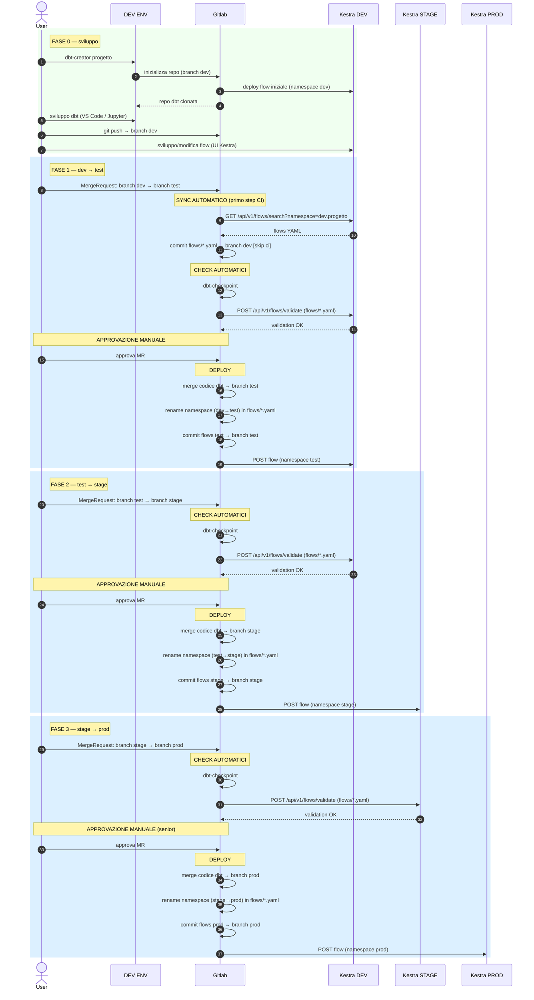

**Regole e flusso per la promozione dei progetti dbt e delle pipeline di orchestrazione tra i vari ambienti.**

Scelte architetturali principali:
- I flow Kestra risiedono nella cartella `/flows/` del progetto dbt — unica fonte di verità per codice e orchestrazione
- Kestra è **agnostico rispetto all'ambiente**: esegue un progetto dbt su un determinato branch; la configurazione degli ambienti (connessioni Dremio, Nessie, MinIO) è incapsulata nei profili dbt
- La sincronizzazione Kestra → Git è il **primo step automatico della pipeline MR** (dev→test): GitLab CI scarica i flow dall'API Kestra e li committa su branch `dev` prima di qualsiasi validazione — nessuna azione manuale richiesta allo sviluppatore
- L'isolamento tra stage e prod è garantito da **tre istanze Kestra distinte** (DEV, STAGE, PROD) su namespace Kubernetes separati — vedi [[#ISOLAMENTO STAGE]]
- Ogni promozione è soggetta a gate automatici + approvazione manuale (vedi [[#GATE DI APPROVAZIONE]])

---

## DIAGRAMMA SEQUENCE





## AMBIENTI

Kubernetes: due cluster separati
- **Cluster DEV** — ambienti `dev` e `test`
- **Cluster PROD** — ambienti `stage` e `prod`

Ogni ambiente ha il proprio namespace Kestra e il proprio profilo dbt (connessioni Dremio, Nessie/MinIO, schema target).

**Tre istanze Kestra** su namespace Kubernetes distinti:

| Istanza | Cluster K8s | Namespace K8s | Namespace Kestra gestiti |
|---|---|---|---|
| **Kestra DEV** | DEV | `kestra-dev` | `dev.<progetto>`, `test.<progetto>` |
| **Kestra STAGE** | PROD | `kestra-stage` | `stage.<progetto>` |
| **Kestra PROD** | PROD | `kestra-prod` | `prod.<progetto>` |

La separazione in namespace K8s distinti (anche all'interno del cluster PROD) consente di applicare Kubernetes ResourceQuota su `kestra-stage`, garantendo che pipeline stage non sottraggano risorse a prod. Vedi [[#ISOLAMENTO STAGE]] per la configurazione completa.

---

## ATTORI

- Utente Sviluppatore
- GitLab
- Kestra DEV
- Kestra STAGE
- Kestra PROD

### Utente Sviluppatore

Sviluppatore dei progetti dbt.

Ruolo:
- Sviluppa il progetto dbt (VS Code / Jupyter) e lo pusha su branch `dev`
- Sviluppa e modifica i flow Kestra nell'UI di Kestra DEV
- Effettua le Merge Request per la promozione tra ambienti:
	- `dev` → `test` (stesso cluster DEV)
	- `test` → `stage` (cambio cluster: DEV → PROD, istanza Kestra STAGE)
	- `stage` → `prod` (stesso cluster PROD, istanza Kestra PROD, approvazione senior)

### GitLab

Repository centrale del codice sorgente e motore CI/CD.

**Repository gestite:**
1. Template cookie-cutter del progetto dbt (`/dbt/models/cookiecutter-dbt-template-kestra`) — da cui vengono creati i singoli progetti
2. Repository dei progetti dbt (`/data-platform/<gruppo>/<progetto>/`). Ogni repo contiene:
	- Codice e configurazione dbt (modelli, test, macro, profili per tutti gli ambienti)
	- `/flows/` — dir contenente i flow Kestra del progetto (fonte di verità dopo ogni sync)
	- `.gitlab-ci.yml` — pipeline CI/CD con gli stage: `validate`, `deploy_TEST`, `deploy_STAGE`, `deploy_PROD`
	- Script Python di esecuzione dbt (run, test, dbt-osmosis, ingestion OpenMetadata)

**Ruoli GitLab:**
- Versioning e branching delle repository
- Esecuzione dei gate automatici (dbt-checkpoint, validazione flow Kestra)
- Promozione artefatti tra ambienti (codice dbt + flow Kestra) via Merge Request

### Kestra

Orchestratore delle pipeline. **Agnostico rispetto all'ambiente**: esegue un progetto dbt su un branch specificato; tutta la logica di configurazione per ambiente è nel profilo dbt.

**Tre istanze** (vedi [[#ISOLAMENTO STAGE]] per la configurazione IaC):
- **Kestra DEV** — namespace `dev.<progetto>` e `test.<progetto>`
- **Kestra STAGE** — namespace `stage.<progetto>`
- **Kestra PROD** — namespace `prod.<progetto>`

**Responsabilità:**
- Scheduling ed esecuzione delle pipeline dbt
- Kestra DEV ospita il meta-flow `sync-flows-to-gitlab` come **backup notturno** (non è il meccanismo primario di sync — vedi [[#GESTIONE FLOW KESTRA]])

---

## FASI

### FASE 0 — SVILUPPO

**Utente esegue `dbt-creator`**. Lo script crea e inizializza:
- **Progetto dbt** — configurato con profilo `dev`, branch git `dev`, tutti i profili ambiente (dev/test/stage/prod)
- **Flow Kestra base** (`/flows/<progetto>.yaml`) — inviato automaticamente a Kestra DEV (namespace `dev.<progetto>`)
- **Pipeline CI/CD GitLab** (`.gitlab-ci.yml`) — con gli stage di promozione e validazione

**Utente sviluppa il progetto dbt**
- Sviluppo in VS Code / Jupyter, push su branch `dev`
- L'esecuzione dbt include: `dbt run` + `dbt test` + `dbt-osmosis` (manutenzione metadati YAML) + ingestion su OpenMetadata (in sperimentazione)
- I test dbt (data quality + metadati) sono prerequisito alla promozione

**Utente sviluppa la pipeline Kestra**
- Sviluppo e modifica direttamente nell'UI di Kestra DEV (namespace `dev.<progetto>`)

### FASE 1 — DEV → TEST

1. Utente apre **Merge Request** `branch dev → branch test`
2. GitLab esegue il **sync automatico** (primo step, prima di qualsiasi check):
	- `GET /api/v1/flows/search?namespace=dev.<progetto>` su Kestra DEV
	- Per ogni flow: `GET /api/v1/flows/dev.<progetto>/<id>` con `Accept: application/x-yaml`
	- Commit dei flow scaricati in `flows/*.yaml` su branch `dev` con flag `[skip ci]`
3. GitLab esegue i **check automatici** (sui flow appena sincronizzati):
	- `dbt-checkpoint` — verifica qualità e conformità del progetto dbt
	- `POST /api/v1/flows/validate` su Kestra DEV — validazione sintassi e schema dei flow YAML
4. **Approvazione manuale** da parte del reviewer
5. All'approvazione della MR, GitLab esegue `deploy_TEST`:
	1. Merge del codice dbt su branch `test` (profilo dbt `test`)
	2. Rename namespace `dev → test` nei flow (sostituzione chirurgica sul campo `namespace:`, vedi [[#NAMESPACE RENAME]])
	3. Commit dei flow aggiornati su branch `test` (`/flows/`)
	4. `curl POST` dei flow su Kestra DEV (namespace `test.<progetto>`)
6. Progetto dbt e pipeline Kestra disponibili sull'ambiente `test`

### FASE 2 — TEST → STAGE

1. Utente apre **Merge Request** `branch test → branch stage`
2. GitLab esegue i **check automatici**:
	- `dbt-checkpoint`
	- `POST /api/v1/flows/validate` su **Kestra STAGE**
3. **Approvazione manuale**
4. All'approvazione, GitLab esegue `deploy_STAGE`:
	1. Merge del codice dbt su branch `stage` (profilo dbt `stage`)
	2. Rename namespace `test → stage` nei flow (da branch `test`, scrittura su branch `stage`)
	3. Commit dei flow aggiornati su branch `stage`
	4. `curl POST` dei flow su **Kestra STAGE** (namespace `stage.<progetto>`)
5. Progetto dbt e pipeline Kestra disponibili sull'ambiente `stage`

### FASE 3 — STAGE → PROD

1. Utente apre **Merge Request** `branch stage → branch prod`
2. GitLab esegue i **check automatici**:
	- `dbt-checkpoint`
	- `POST /api/v1/flows/validate` su **Kestra STAGE** (i flow vengono validati sull'istanza che li esegue in stage, prima di promuoverli a prod)
3. **Approvazione manuale** (richiesta approvazione senior)
4. All'approvazione, GitLab esegue `deploy_PROD`:
	1. Merge del codice dbt su branch `prod` (profilo dbt `prod`)
	2. Rename namespace `stage → prod` nei flow (da branch `stage`, scrittura su branch `prod`)
	3. Commit dei flow aggiornati su branch `prod`
	4. `curl POST` dei flow su **Kestra PROD** (namespace `prod.<progetto>`)
5. Progetto dbt e pipeline Kestra disponibili sull'ambiente `prod`

---

## GESTIONE FLOW KESTRA

I flow Kestra vengono sviluppati nell'UI di Kestra DEV.

### Meccanismo primario — fetch automatico in pipeline MR

Il sync è il **primo step automatico** della pipeline GitLab CI alla apertura di una MR `dev → test`. GitLab CI scarica i flow direttamente dall'API Kestra e li committa sul branch `dev` prima di procedere con i check. Lo sviluppatore non deve fare nulla di manuale. Vedi lo script `sync_flows_from_kestra.py` in [[#APPENDICE TECNICA]].

### Meccanismo di backup — meta-flow notturno

Come rete di sicurezza esiste un meta-flow Kestra che gira ogni notte e sincronizza i flow su Git. Garantisce che il branch `dev` non diverga di più di un giorno da Kestra DEV, indipendentemente dall'attività delle MR.

```yaml
id: sync-flows-to-gitlab
namespace: system
description: "Backup notturno: sincronizza i flow Kestra DEV su GitLab (branch dev)"

triggers:
  - id: nightly-backup
    type: io.kestra.plugin.core.trigger.Schedule
    cron: "0 2 * * *"

tasks:
  - id: push-flows
    type: io.kestra.plugin.git.Push
    url: "https://gitlab.example.com/data-platform/dbt/{{ inputs.progetto }}.git"
    branch: dev
    directory: flows/
    username: "{{ secret('GITLAB_USER') }}"
    password: "{{ secret('GITLAB_TOKEN') }}"
    commitMessage: "chore: nightly kestra flows backup - {{ now() }} [skip ci]"
```

> [!note]
> Il `[skip ci]` nel commit message impedisce che il push notturno avvii una nuova pipeline GitLab.

---

## GATE DI APPROVAZIONE

Ogni promozione è soggetta a due fasi di approvazione:

### Gate automatici (GitLab CI)

| Check | Tool | Cosa verifica |
|---|---|---|
| Qualità dbt | `dbt-checkpoint` | Conformità modelli, test obbligatori, documentazione metadati |
| Test dbt | `dbt test` (integrato nello script) | Data quality, unicità, not-null, relazioni |
| Validazione flow Kestra | `POST /api/v1/flows/validate` | Sintassi YAML, schema Kestra, task plugin esistenti |

### Gate manuale

| Fase         | Approvatore                  | Note                              |
| ------------ | ---------------------------- | --------------------------------- |
| dev → test   | Developer                    | Auto-approvazione ammessa         |
| test → stage | Developer senior / Tech Lead | Verifica che i test siano passati |
| stage → prod | Senior / Team Lead           | Approvazione esplicita richiesta  |

> [!todo] Da definire
> - Numero minimo di approvatori per stage→prod
> - Checklist manuale di verifica pre-prod (es. verifica dati in stage, timing deploy)
> - Gestione delle approvazioni in caso di urgenza/hotfix

---

## NAMESPACE RENAME

Il rename del namespace Kestra tra ambienti (`dev→test`, `test→stage`, `stage→prod`) va effettuato in modo **chirurgico** tramite parsing YAML, non con sostituzione testuale generica.

Motivazione: una sostituzione `sed s/dev/test/g` modificherebbe anche eventuali occorrenze di "dev" in descrizioni, commenti, path S3, nomi variabili — producendo file corrotti o configurazioni errate.

**Implementazione consigliata nello script CI/CD:**

```python
import yaml
from pathlib import Path

def rename_namespace(flow_path: Path, source_env: str, target_env: str):
    with open(flow_path) as f:
        flow = yaml.safe_load(f)
    # Sostituisce solo il campo namespace
    if 'namespace' in flow:
        flow['namespace'] = flow['namespace'].replace(source_env, target_env)
    with open(flow_path, 'w') as f:
        yaml.dump(flow, f, allow_unicode=True, default_flow_style=False)
```

---

## ROLLBACK

In caso di deploy errato, la procedura di rollback si basa sul git history dei branch.

**Rollback dbt (codice):**
1. Identificare il commit precedente corretto sul branch target (`git log`)
2. Aprire una MR con il revert del commit, seguendo il normale processo di approvazione
3. Oppure (per urgenza prod): revert diretto con approvazione senior

**Rollback flow Kestra:**
1. Recuperare la versione precedente del flow dal git history del branch (`git show <commit>:flows/<progetto>.yaml`)
2. Fare `curl POST` manuale del flow recuperato verso l'istanza Kestra target
3. Committare il revert su git per mantenere la coerenza

> [!todo] Da automatizzare
> Valutare l'aggiunta di uno stage `rollback` nel `.gitlab-ci.yml` che, dato un commit hash, esegua automaticamente il revert e il re-deploy del flow.

---

## BRANCHING NESSIE

> [!warning] Decisione architetturale aperta

La configurazione del catalogo dati (Nessie/Iceberg) è gestita nei profili dbt, con due opzioni in valutazione:

| Opzione | Pro | Contro |
|---|---|---|
| **Nessie branching** (`dev`/`test`/`stage`/`main`) | Promozione atomica cross-tabella, time travel, nessuna duplicazione dati | Richiede connector dbt-dremio custom; Nessie ha un singolo catalogo (blast radius potenziale); strategia di protezione branch da definire |
| **S3 bucket/folder separati per ambiente** | Isolamento fisico semplice, connector standard, nessun rischio cross-ambiente | Nessuna atomicità, potenziale duplicazione dati, promozione = copia fisica |

**Note sul connector dbt-dremio ufficiale:** Dremio (sponsor di Nessie) non supporta il branching Nessie nel proprio connector dbt — suggerisce che il modello multi-ambiente raccomandato da Dremio sia basato su Spaces/Folders, non su Nessie branches. È sviluppato internamente un connector custom che supporta il branching.

**Se si adotta Nessie branching**, misure di sicurezza minime:
- Branch `main`/`prod` scrivibile solo da service account CI/CD (mai da utenti)
- Ogni profilo dbt specifica esplicitamente il branch target — nessuna scrittura implicita su main
- Validazione del branch target nel connector custom prima di ogni operazione di scrittura

> [!todo] Approfondimento necessario
> - Valutare approccio ibrido: S3 folders per dev/test (sviluppo agile), Nessie branching per stage→prod (promozione atomica)
> - Definire strategia di branch protection su Nessie
> - Verificare roadmap Dremio per supporto nativo Nessie branching nel connector dbt

---

## APPENDICE TECNICA

### Struttura `.gitlab-ci.yml`

```yaml
# .gitlab-ci.yml — generato da dbt-creator, incluso nella repo del progetto

variables:
  KESTRA_DEV_URL:   "https://kestra-dev.internal"
  KESTRA_STAGE_URL: "https://kestra-stage.internal"
  KESTRA_PROD_URL:  "https://kestra-prod.internal"
  DBT_PROJECT: "nome_progetto"            # iniettato da dbt-creator
  FLOWS_DIR: "flows"

stages:
  - sync       # fetch flow da Kestra (solo MR dev→test)
  - validate   # dbt-checkpoint + validazione YAML Kestra
  - deploy     # rename namespace + commit + POST su Kestra

# ── SYNC KESTRA → GIT (solo MR dev→test) ──────────────────────────────────────

sync-kestra-flows:
  stage: sync
  rules:
    - if: >
        $CI_PIPELINE_SOURCE == "merge_request_event" &&
        $CI_MERGE_REQUEST_SOURCE_BRANCH_NAME == "dev" &&
        $CI_MERGE_REQUEST_TARGET_BRANCH_NAME == "test"
  script:
    - pip install requests pyyaml
    - python scripts/sync_flows_from_kestra.py
    - git config user.email "gitlab-ci@internal"
    - git config user.name "GitLab CI"
    - git checkout $CI_MERGE_REQUEST_SOURCE_BRANCH_NAME
    - git add $FLOWS_DIR/
    - git diff --cached --quiet && echo "No flow changes" || (
        git commit -m "ci: sync kestra flows from DEV [skip ci]" &&
        git push origin $CI_MERGE_REQUEST_SOURCE_BRANCH_NAME
      )

# ── GATE AUTOMATICI ────────────────────────────────────────────────────────────

validate-dbt:
  stage: validate
  needs: ["sync-kestra-flows"]   # attende il sync (presente solo per MR dev→test)
  rules:
    - if: '$CI_PIPELINE_SOURCE == "merge_request_event"'
  script:
    - pip install dbt-checkpoint
    - dbt-checkpoint run-checks
  artifacts:
    reports:
      junit: dbt_checkpoint_report.xml

validate-kestra-flows:
  stage: validate
  needs: ["sync-kestra-flows"]   # attende il sync (presente solo per MR dev→test)
  rules:
    - if: '$CI_PIPELINE_SOURCE == "merge_request_event"'
  script:
    - |
      # Sceglie l'istanza Kestra in base al branch target della MR
      case "$CI_MERGE_REQUEST_TARGET_BRANCH_NAME" in
        test)  KESTRA_URL=$KESTRA_DEV_URL   ;;
        stage) KESTRA_URL=$KESTRA_STAGE_URL ;;
        prod)  KESTRA_URL=$KESTRA_PROD_URL  ;;
        *)     echo "Branch target non riconosciuto"; exit 1 ;;
      esac

      for f in $FLOWS_DIR/*.yaml; do
        echo "Validating $f ..."
        HTTP_STATUS=$(curl -s -o /tmp/validate_response.json -w "%{http_code}" \
          -X POST "$KESTRA_URL/api/v1/flows/validate" \
          -H "Content-Type: application/x-yaml" \
          -H "Authorization: Bearer $KESTRA_API_TOKEN" \
          --data-binary "@$f")
        if [ "$HTTP_STATUS" != "200" ]; then
          echo "ERRORE validazione $f (HTTP $HTTP_STATUS):"
          cat /tmp/validate_response.json
          exit 1
        fi
      done

# ── DEPLOY TEST ────────────────────────────────────────────────────────────────

deploy-test:
  stage: deploy
  rules:
    - if: '$CI_COMMIT_BRANCH == "test"'       # si attiva al merge su branch test
  script:
    - pip install pyyaml
    - python scripts/rename_namespace.py dev test $FLOWS_DIR
    - git config user.email "gitlab-ci@internal"
    - git config user.name "GitLab CI"
    - git add $FLOWS_DIR/
    - git commit -m "ci: update kestra flows namespace dev→test [skip ci]" || echo "No changes"
    - git push origin test
    - |
      for f in $FLOWS_DIR/*.yaml; do
        curl -sf -X POST "$KESTRA_DEV_URL/api/v1/flows" \
          -H "Content-Type: application/x-yaml" \
          -H "Authorization: Bearer $KESTRA_API_TOKEN" \
          --data-binary "@$f" \
          || exit 1
      done

# ── DEPLOY STAGE ───────────────────────────────────────────────────────────────

deploy-stage:
  stage: deploy
  rules:
    - if: '$CI_COMMIT_BRANCH == "stage"'
  script:
    - pip install pyyaml
    - python scripts/rename_namespace.py test stage $FLOWS_DIR
    - git config user.email "gitlab-ci@internal"
    - git config user.name "GitLab CI"
    - git add $FLOWS_DIR/
    - git commit -m "ci: update kestra flows namespace test→stage [skip ci]" || echo "No changes"
    - git push origin stage
    - |
      for f in $FLOWS_DIR/*.yaml; do
        curl -sf -X POST "$KESTRA_STAGE_URL/api/v1/flows" \
          -H "Content-Type: application/x-yaml" \
          -H "Authorization: Bearer $KESTRA_API_TOKEN" \
          --data-binary "@$f" \
          || exit 1
      done

# ── DEPLOY PROD ────────────────────────────────────────────────────────────────

deploy-prod:
  stage: deploy
  rules:
    - if: '$CI_COMMIT_BRANCH == "prod"'
  script:
    - pip install pyyaml
    - python scripts/rename_namespace.py stage prod $FLOWS_DIR
    - git config user.email "gitlab-ci@internal"
    - git config user.name "GitLab CI"
    - git add $FLOWS_DIR/
    - git commit -m "ci: update kestra flows namespace stage→prod [skip ci]" || echo "No changes"
    - git push origin prod
    - |
      for f in $FLOWS_DIR/*.yaml; do
        curl -sf -X POST "$KESTRA_PROD_URL/api/v1/flows" \
          -H "Content-Type: application/x-yaml" \
          -H "Authorization: Bearer $KESTRA_API_TOKEN" \
          --data-binary "@$f" \
          || exit 1
      done
```

**Variabili GitLab CI da configurare come secrets** (Settings → CI/CD → Variables):

| Variabile | Scope | Descrizione |
|---|---|---|
| `KESTRA_API_TOKEN` | All environments | Token API Kestra (uno per istanza se IdP separati, unico se condiviso) |
| `KESTRA_STAGE_API_TOKEN` | stage | Token API Kestra STAGE (se diverso da DEV) |
| `GITLAB_TOKEN` | All environments | Token per il meta-flow sync Kestra → Git (Personal Access Token o Project Token con scope `write_repository`) |
| `DBT_DREMIO_PASSWORD_DEV` | dev | Password connessione Dremio per profilo dev |
| `DBT_DREMIO_PASSWORD_TEST` | test | Password connessione Dremio per profilo test |
| `DBT_DREMIO_PASSWORD_STAGE` | stage | Password connessione Dremio per profilo stage |
| `DBT_DREMIO_PASSWORD_PROD` | prod | Password connessione Dremio per profilo prod |

---

### Script `sync_flows_from_kestra.py`

Collocato in `scripts/sync_flows_from_kestra.py`. Scarica tutti i flow del namespace `dev.<progetto>` da Kestra DEV e li salva in `flows/`. Viene eseguito dallo stage `sync-kestra-flows` della pipeline MR `dev → test`.

```python
#!/usr/bin/env python3
"""
Scarica i flow Kestra dal namespace dev.<DBT_PROJECT> e li salva in FLOWS_DIR.
Variabili d'ambiente richieste:
  KESTRA_DEV_URL   es. https://kestra-dev.internal
  KESTRA_API_TOKEN token API Kestra
  DBT_PROJECT      nome del progetto dbt (es. "anagrafe_edifici")
  FLOWS_DIR        directory di destinazione (default: "flows")
"""
import os
import sys
from pathlib import Path

import requests
import yaml


def main():
    kestra_url = os.environ["KESTRA_DEV_URL"].rstrip("/")
    token = os.environ["KESTRA_API_TOKEN"]
    project = os.environ["DBT_PROJECT"]
    flows_dir = Path(os.environ.get("FLOWS_DIR", "flows"))
    namespace = f"dev.{project}"

    headers = {
        "Authorization": f"Bearer {token}",
        "Accept": "application/json",
    }

    # 1. Lista tutti i flow nel namespace
    resp = requests.get(
        f"{kestra_url}/api/v1/flows/search",
        params={"namespace": namespace, "size": 100},
        headers=headers,
        timeout=30,
    )
    resp.raise_for_status()
    results = resp.json().get("results", [])

    if not results:
        print(f"ATTENZIONE: nessun flow trovato nel namespace '{namespace}'")
        sys.exit(0)

    flows_dir.mkdir(parents=True, exist_ok=True)

    # 2. Per ogni flow, scarica il YAML e salva su disco
    fetched = 0
    for flow_meta in results:
        flow_id = flow_meta["id"]
        resp_yaml = requests.get(
            f"{kestra_url}/api/v1/flows/{namespace}/{flow_id}",
            headers={**headers, "Accept": "application/x-yaml"},
            timeout=30,
        )
        resp_yaml.raise_for_status()

        out_path = flows_dir / f"{flow_id}.yaml"
        out_path.write_text(resp_yaml.text, encoding="utf-8")
        print(f"  OK  {flow_id}.yaml")
        fetched += 1

    print(f"\nRiepilogo: {fetched} flow scaricati in '{flows_dir}/'")


if __name__ == "__main__":
    main()
```

> [!note] `needs` in GitLab CI
> I job `validate-dbt` e `validate-kestra-flows` dichiarano `needs: ["sync-kestra-flows"]`. GitLab gestisce automaticamente il caso in cui `sync-kestra-flows` non esiste (MR diverse da `dev→test`): i job di validate partono comunque senza attendere.

---

### Script `rename_namespace.py`

Collocato in `scripts/rename_namespace.py` della repo del progetto dbt. Generato da dbt-creator e uguale per tutti i progetti.

```python
#!/usr/bin/env python3
"""
Rinomina il campo `namespace` nei flow Kestra YAML.
Sostituzione chirurgica: modifica solo il campo namespace,
non le occorrenze della stringa nell'intero file.

Uso: python rename_namespace.py <source_env> <target_env> <flows_dir>
Es.: python rename_namespace.py dev test flows/
"""
import sys
import yaml
from pathlib import Path


def rename_namespace(flow_path: Path, source_env: str, target_env: str) -> bool:
    """Restituisce True se il file è stato modificato."""
    with open(flow_path, encoding="utf-8") as f:
        flow = yaml.safe_load(f)

    if not isinstance(flow, dict) or "namespace" not in flow:
        print(f"  SKIP {flow_path.name}: campo 'namespace' non trovato")
        return False

    old_ns = flow["namespace"]
    new_ns = old_ns.replace(source_env, target_env, 1)  # solo prima occorrenza

    if old_ns == new_ns:
        print(f"  SKIP {flow_path.name}: namespace '{old_ns}' non contiene '{source_env}'")
        return False

    flow["namespace"] = new_ns
    with open(flow_path, "w", encoding="utf-8") as f:
        yaml.dump(flow, f, allow_unicode=True, default_flow_style=False, sort_keys=False)

    print(f"  OK   {flow_path.name}: '{old_ns}' → '{new_ns}'")
    return True


def main():
    if len(sys.argv) != 4:
        print("Uso: rename_namespace.py <source_env> <target_env> <flows_dir>")
        sys.exit(1)

    source_env, target_env, flows_dir = sys.argv[1], sys.argv[2], sys.argv[3]
    flows_path = Path(flows_dir)

    if not flows_path.is_dir():
        print(f"ERRORE: directory '{flows_dir}' non trovata")
        sys.exit(1)

    yaml_files = list(flows_path.glob("*.yaml")) + list(flows_path.glob("*.yml"))
    if not yaml_files:
        print(f"ATTENZIONE: nessun file YAML trovato in '{flows_dir}'")
        sys.exit(0)

    modified = 0
    for f in sorted(yaml_files):
        if rename_namespace(f, source_env, target_env):
            modified += 1

    print(f"\nRiepilogo: {modified}/{len(yaml_files)} file modificati")


if __name__ == "__main__":
    main()
```

---

### ISOLAMENTO STAGE — Terza istanza Kestra

Kestra STAGE è un'istanza dedicata deployata nel cluster PROD in un namespace K8s separato (`kestra-stage`). La configurazione è gestita via Helm IaC in GitLab, con un file base condiviso tra STAGE e PROD e file di override per le differenze.

**Struttura file Helm** (in repo infrastruttura):

```
99 System/helm/kestra/
├── values-base.yaml    ← configurazione comune (immagine, plugin, storage, auth)
├── values-stage.yaml   ← override stage (repliche ridotte, URL, namespace)
└── values-prod.yaml    ← override prod (repliche full, URL, namespace)
```

**`values-base.yaml`** — condiviso, fonte di verità per la versione Kestra e i plugin:

```yaml
image:
  tag: "0.19.x"           # versione Kestra — identica per stage e prod

configuration:
  kestra:
    storage:
      type: minio
      minio:
        endpoint: "http://minio.internal:9000"
        # credenziali via secret K8s

    plugins:
      repositories:
        - https://repo1.maven.org/maven2/

extraInitContainers:
  - name: install-plugins
    image: kestra/kestra:0.19.x
    command:
      - kestra
      - plugins
      - install
      - io.kestra.plugin:plugin-git:LATEST
      - io.kestra.plugin:plugin-scripts-python:LATEST
```

**`values-stage.yaml`** — risorse ridotte (pre-prod, non concorrente con prod):

```yaml
nameOverride: "kestra-stage"
fullnameOverride: "kestra-stage"

webserver:
  replicaCount: 1
  resources:
    requests: { cpu: "500m", memory: "512Mi" }
    limits:   { cpu: "1",    memory: "1Gi"  }

worker:
  replicaCount: 1
  resources:
    requests: { cpu: "1",  memory: "2Gi" }
    limits:   { cpu: "2",  memory: "4Gi" }

configuration:
  kestra:
    url: "https://kestra-stage.internal"
```

**`values-prod.yaml`** — risorse full:

```yaml
nameOverride: "kestra-prod"
fullnameOverride: "kestra-prod"

webserver:
  replicaCount: 2
  resources:
    requests: { cpu: "1",  memory: "1Gi" }
    limits:   { cpu: "2",  memory: "2Gi" }

worker:
  replicaCount: 3
  resources:
    requests: { cpu: "2",  memory: "4Gi" }
    limits:   { cpu: "4",  memory: "8Gi" }

configuration:
  kestra:
    url: "https://kestra-prod.internal"
```

**Pipeline GitLab CI per il deploy dell'infrastruttura** (repo infra separata):

```yaml
stages:
  - deploy-stage-infra
  - deploy-prod-infra

deploy-kestra-stage:
  stage: deploy-stage-infra
  rules:
    - changes:
        - helm/kestra/values-base.yaml
        - helm/kestra/values-stage.yaml
  script:
    - helm upgrade --install kestra-stage kestra/kestra
        --version 0.19.x
        -f helm/kestra/values-base.yaml
        -f helm/kestra/values-stage.yaml
        --namespace kestra-stage
        --create-namespace
        --wait

deploy-kestra-prod:
  stage: deploy-prod-infra
  needs: ["deploy-kestra-stage"]   # PROD si deploya solo dopo STAGE ok
  when: manual                     # approvazione esplicita per PROD
  rules:
    - changes:
        - helm/kestra/values-base.yaml
        - helm/kestra/values-prod.yaml
  script:
    - helm upgrade --install kestra-prod kestra/kestra
        --version 0.19.x
        -f helm/kestra/values-base.yaml
        -f helm/kestra/values-prod.yaml
        --namespace kestra-prod
        --create-namespace
        --wait
```

> [!note] Promozione infrastruttura = stessa logica dei dati
> Gli aggiornamenti Kestra (nuova versione, nuovi plugin) vengono prima applicati a STAGE e validati, poi promossi manualmente a PROD. Il drift è strutturalmente impossibile: `values-base.yaml` è l'unica fonte di verità per immagine e plugin.

**Kubernetes ResourceQuota su namespace `kestra-stage`:**

```yaml
apiVersion: v1
kind: ResourceQuota
metadata:
  name: kestra-stage-quota
  namespace: kestra-stage
spec:
  hard:
    requests.cpu: "2"
    requests.memory: "4Gi"
    limits.cpu: "4"
    limits.memory: "8Gi"
    pods: "10"
```

```bash
kubectl apply -f helm/kestra/resourcequota-stage.yaml
kubectl describe resourcequota kestra-stage-quota -n kestra-stage
```

---

## DECISIONI APERTE

| #   | Decisione                                                  | Stato             | Note                                                                                                       |
| --- | ---------------------------------------------------------- | ----------------- | ---------------------------------------------------------------------------------------------------------- |
| 1   | Isolamento stage/prod su Kestra PROD                       | **Decisa ✅**     | Terza istanza Kestra STAGE in namespace K8s `kestra-stage` (cluster PROD). IaC Helm con `values-base.yaml` condiviso. ResourceQuota su `kestra-stage`. Vedi [[#ISOLAMENTO STAGE]] |
| 2   | Strategia branching dati (Nessie vs S3 folders)            | **Aperta**        | Vedi [[#BRANCHING NESSIE]]                                                                                 |
| 3   | Approvazione MR stage→prod: numero approvatori e checklist | **Da definire**   |                                                                                                            |
| 4   | Automazione rollback (stage rollback in CI/CD)             | **Da valutare**   |                                                                                                            |
| 5   | Gestione progetti con più flow Kestra                      | **Aperta**        | Il meta-flow sync e il rename devono iterare su tutti i file in `/flows/` — da testare con casi multi-flow |
| 6   | Progetto dbt con dipendenze cross-progetto                 | **Aperta**        | Promozione atomica di più progetti interdipendenti non gestita                                             |

## Conversazione

## PROMPT 1

```text
Sto definendo la procedura di CI/CD per il progetto Data Platform.
- '03 WIKI/Architettura (Sintesi).md' contiene una sintesi dell'architettura
- '02 PROJECT/PROCESS/CI-CD GIT FLOW v2.md' contiene una ipotesi di ci/cd
Analizza l'ipotesi in maniera approfondita e riporta le tue osservazioni, in particolare eventuali problemi o mancanze.
Se hai bisogno di informazioni mancanti chiedimele
```

## ANALISI - PARTE 1 

  Analisi CI/CD GIT FLOW v2

  Punti di forza

  - La struttura a 4 ambienti (dev → test → stage → prod) con separazione infrastrutturale Kubernetes è corretta e allineata alle best practice.
  - Tenere i flow Kestra nella cartella /flows/ del progetto dbt è una scelta intelligente: un singolo repo come fonte di verità per codice +
  orchestrazione.
  - Il meccanismo di trigger via MR su GitLab è standard e auditabile.

  ---
  Problemi e Lacune

  1. Kestra NON è git-first durante lo sviluppo (critico)

  Il flow Kestra viene sviluppato direttamente nell'UI di Kestra DEV e salvato su git solo al momento della MR. Questo significa:

  - Nessuna traccia incrementale delle modifiche al flow durante lo sviluppo.
  - Se Kestra DEV ha un problema prima della MR, le modifiche al flow sono perse.
  - Il developer potrebbe dimenticare di includere le ultime modifiche al flow nella MR.
  - Non è possibile fare git diff per vedere cosa è cambiato nel flow.

  Alternativa consigliata: il developer sviluppa il flow YAML in locale (VS Code), lo committa su branch dev, e GitLab CI lo deploya su Kestra DEV.
  Kestra DEV diventa un'istanza managed, non la fonte di verità.

  ---
  2. Nessun gate di testing/validazione prima della promozione

  In nessuna fase è prevista l'esecuzione automatica di:
  - dbt test (data tests: unique, not_null, relazioni)
  - dbt compile per verificare la correttezza SQL
  - Validazione sintattica del YAML Kestra prima del deploy
  - Smoke test nel target environment dopo il deploy

  Una MR può essere approvata e deployare codice che fallisce immediatamente in produzione.

  ---
  3. Il rename del namespace è fragile

  La sostituzione dev→test→stage→prod nel YAML del flow è una semplice operazione testuale. Rischi:

  - La stringa "dev" può apparire in descrizioni, commenti, nomi di variabili, path (es. s3://bucket-dev/path/).
  - Sostituzione indiscriminata può corrompere il YAML o produrre configurazioni errate.
  - Serve una sostituzione chirurgica (es. solo il campo namespace: e eventuali riferimenti espliciti all'ambiente), non un sed s/dev/test/g.

  ---
  4. Manca l'integrazione con Nessie (critico per i dati)

  L'architettura prevede che dbt usi Project Nessie per il branching del Data Lake (dev/test/stage/prod). Il CI/CD attuale:

  - Non coordina la promozione del codice dbt con il merge dei branch Nessie.
  - Se il branch test su Nessie non esiste o non è allineato, il deploy dbt su test fallirà o lavorerà su dati sbagliati.
  - Serve una fase esplicita: al passaggio da dev→test, fare il merge del branch Nessie dev → test (o creare il branch se non esiste).

  ---
  5. Configurazioni ambiente-specifiche nei flow non gestite

  Il semplice rename del namespace non è sufficiente. I flow Kestra possono contenere:
  - Path S3/MinIO (s3://bucket-dev/...)
  - Endpoint URL (es. Dremio dev vs prod)
  - Credenziali / secret reference
  - Nomi di tabelle o schemi Iceberg

  Questi valori non cambiano con il solo rename del namespace. Serve una strategia (es. variabili Kestra per environment, template con placeholder).

  ---
  6. Nessuna procedura di rollback

  Non è definito cosa fare in caso di deploy fallito o regressione in produzione:
  - Come si ripristina il flow precedente su Kestra PROD?
  - Come si fa il rollback del branch dbt su GitLab?
  - Il git history contiene i flow precedenti, ma non c'è una procedura automatizzata di rollback.

  ---
  7. Stage e Prod condividono Kestra PROD (rischio di cross-contamination)

  Stage e Prod girano sulla stessa istanza Kestra PROD (separati solo per namespace). Un flow stage mal configurato può:
  - Saturare i worker Kestra condivisi, impattando PROD.
  - Scrivere su path dati sbagliati se i path non sono correttamente parametrizzati.
  - Rendere più difficile il debug (log misti).

  Valutare se i namespace sono sufficienti o se serve isolamento più forte.

  ---
  8. Gestione dei secret non definita

  Non è specificato come vengono gestiti:
  - Token Kestra API per le chiamate curl nella CI/CD
  - Credenziali dbt per i profili dei vari ambienti (connessione Dremio, Nessie)
  - Credenziali MinIO per accesso S3 nei flow Kestra

  Presumibilmente tramite GitLab CI/CD variables (secrets), ma non è esplicitato e non c'è un modello di gestione sicura.

  ---
  9. Gestione di più flow per singolo progetto non risolta

  Il documento stesso la segnala come questione aperta: "approfondire progetti con + flow". Un progetto dbt realistico avrà probabilmente più flow
  Kestra (es. ingestion + trasformazione + qualità). La procedura di promozione deve gestire l'atomicità: tutti i flow di un progetto devono essere
  promossi insieme o nessuno.

  ---
  10. Nessuna integrazione con OpenMetadata post-deploy

  L'architettura prevede OpenMetadata come fonte di verità per lineage e metadati. Il CI/CD non include:
  - Trigger di re-ingestion OpenMetadata dopo un deploy dbt.
  - Aggiornamento dei metadati (versione, owner, descrizione) al momento della promozione.
  - Invio del manifest.json dbt a OpenMetadata per aggiornare il lineage.

  ---
  11. Approvazione MR non definita

  Non è specificato:
  - Chi ha l'autorità di approvare le MR (ruoli: dev, tech lead, DBA, QA)?
  - Quante approvazioni sono richieste per le fasi critiche (stage→prod)?
  - Esiste una checklist manuale di verifica prima dell'approvazione?

  ---
  Domande che ti faccio

  1. Kestra flows: sei disposto a adottare un approccio git-first (sviluppo YAML in locale, deploy automatico su Kestra DEV), oppure vuoi mantenere
  l'UI Kestra come tool di sviluppo primario?
  2. Nessie: i profili dbt per i vari ambienti sono già configurati per puntare a branch Nessie specifici (dev/test/stage/prod)? Il branching Nessie
  è già nella roadmap della CI/CD?
  3. Secret management: è già in uso un sistema di gestione credenziali (es. HashiCorp Vault, GitLab secrets, Kubernetes secrets)?
  4. Testing: esistono già dbt tests nel progetto, o sono da introdurre come prerequisito alla promozione?
  5. Stage isolation: il rischio di condivisione Kestra PROD tra stage e prod è accettabile, o vuoi discutere un'architettura di isolamento più
  forte?


## PROMPT 2


```
Prima di rispondere alle tue domande faccio alcune precisazioni, che nel documento non sono riportate:
  l'esecuzione delle trasformazioni dbt avviene attraverso uno script che effettua le seguenti operazioni:
  - run e test delle trasformazioni
  - manutenzione metadati yaml con dbt-osmosis
  - ingestion metadati su openmetadata (in fase d isperimentazione)
  La fase di approvazione della MR non è ancora definita, verrà comunque utilizzato dbt-checkpoint per bloccare eventuali problemi su dbt, non
  ancora definito per la parte dei flow Kesta. Pensavo ad una approvazione in due fasi: controllo automatico + controllo umano manuale.
  L'elaborazione avviene nel progetto dbt che ha al suo interno configurati gli ambienti, Kestra si occupa solo di eseguire un progetto dbt in un
  determinato branch (ambiente) non è necessario che Kestra conosca l'ambiente (la configurazione degli ambienti è incapsulata nel progetto dbt)
  1. Ingestion (lettura da fonte e scrittura su Nessie)
  2. Analisi (creazione delle viste VDS su Dremio in appositi space/folder

  Riguardo le tue domande:
  1. Kestra flows: preferirei mantenere l'uso dell'UI Kestra: ambiente facile e veloce (no-code). Puoi indicarmi qualche strategia per gestire
  dall'ambiente kestra una qualche forma di salvataggio in gitlab?
  2. Nessie: La configurazione Nessie (come quella di Dremio) è configurata nel profilo dbt (una configurazione per ogni ambiente
  dev/test/stage/deploy). Non ancora deciso se utilizzare i branch Nessie o bucket/cartelle S3 per segregare gli ambienti: il branching Nessie
  sarebbe preferibile, ma il connettore dbt-dremio non lo gestisce, abbiamo sviluppato una versione custom che lo gestisce. Il fatto che Dremio
  (sponsor e autore di Nessie) nel connettore che ha sviluppato per dbt non supporti la gestione dei branch mi lascia perplesso. Inoltre il fatto
  che nessie lavori su un unico catalogo (e non singoli repository come git) mi inquieta: è necessario studiare una strategia di branching sicura.
  3. Secrets: I secrets verranno gestiti principalmente tramite GitLab o Kubernetes
  4. Testing: I test sono integrati nel processo di esecuzione del progetto dbt e sono prerequisito alla promozione (anche test sulla qualità dei
  metadati)
  5. Stage isolation: la ragione che aveva portato a questa scelta era il fatto di avere la sicurezza che il processo funzionasse sull'ambiente di
  produzione, un'ambiente separato potrebbe nel tempo discostarsi da quello di produzione e non garantire al 100% la validità. Tuttavia il rischio
  di esecuzione nell'ambiente prod è sensato. Quale altenativa di maggior isolamento proponi?
```


## ANALISI - PARTE 2

Rispondo punto per punto.

```
  1. Kestra UI → Sync automatico su GitLab

  Kestra ha un plugin nativo per Git: io.kestra.plugin.git.Push. La strategia che consiglio è un meta-flow di backup che gira su Kestra DEV:

  id: sync-flows-to-gitlab
  namespace: system
  triggers:
    - id: manual
      type: io.kestra.plugin.core.trigger.Webhook
    # oppure scheduled:
    - id: nightly
      type: io.kestra.plugin.core.trigger.Schedule
      cron: "0 2 * * *"

  tasks:
    - id: push-flows
      type: io.kestra.plugin.git.Push
      url: https://gitlab.example.com/data-platform/dbt/progetto.git
      branch: dev
      directory: flows/
      username: "{{ secret('GITLAB_USER') }}"
      password: "{{ secret('GITLAB_TOKEN') }}"
      commitMessage: "chore: sync kestra flows from DEV - {{ now() }}"

  Varianti in ordine di preferenza:

  ┌────────────────────────────┬───────────────────────────────┬──────────────────────────────┬─────────────────────────────────────────────────┐
  │         Strategia          │            Trigger            │             Pro              │                     Contro                      │
  ├────────────────────────────┼───────────────────────────────┼──────────────────────────────┼─────────────────────────────────────────────────┤
  │ Git Push plugin            │ Manuale o schedulato da       │ Nativo, no infrastruttura    │ Developer deve ricordarsi di triggerare (se     │
  │ (consigliato)              │ Kestra                        │ extra                        │ manuale)                                        │
  ├────────────────────────────┼───────────────────────────────┼──────────────────────────────┼─────────────────────────────────────────────────┤
  │ Kestra Webhook + GitLab CI │ Webhook su ogni salvataggio   │ Automatico, continuo         │ Richiede configurazione webhook Kestra (non     │
  │                            │ flow                          │                              │ nativo)                                         │
  ├────────────────────────────┼───────────────────────────────┼──────────────────────────────┼─────────────────────────────────────────────────┤
  │ Script periodico su GitLab │ Scheduled pipeline GitLab     │ Semplice da implementare     │ Polling, non event-driven                       │
  │  CI                        │                               │                              │                                                 │
  └────────────────────────────┴───────────────────────────────┴──────────────────────────────┴─────────────────────────────────────────────────┘

  Raccomandazione operativa: il meta-flow viene triggerato manualmente dal developer come prima azione prima di aprire la MR. Questo diventa parte
  del workflow documentato: "prima di aprire la MR, triggera il sync". In alternativa, aggiungerlo come step schedulato notturno come rete di
  sicurezza.

  ---
  2. Nessie branching vs S3 folders

  Le tue perplessità sul connettore dbt-dremio ufficiale sono fondate. La ragione probabile è che Dremio gestisce il multi-ambiente tramite Dremio
  Spaces/Folders (che sono il loro layer di virtualizzazione), non tramite Nessie branches — Nessie è pensato più per isolamento transazionale che
  per CI/CD ambientale nel loro modello. Questo però non significa che il tuo approccio custom sia sbagliato.

  Confronto pratico per il tuo caso:

  ┌────────────────────────────────┬─────────────────────────────────────────────────────┬───────────────────────────────────────┐
  │            Aspetto             │                  Nessie Branching                   │          S3 Buckets/Folders           │
  ├────────────────────────────────┼─────────────────────────────────────────────────────┼───────────────────────────────────────┤
  │ Isolamento dati                │ Ottimo (copy-on-write)                              │ Buono (separazione fisica)            │
  ├────────────────────────────────┼─────────────────────────────────────────────────────┼───────────────────────────────────────┤
  │ Promozione dati                │ Merge atomico cross-tabella                         │ Copia fisica (potenzialmente costosa) │
  ├────────────────────────────────┼─────────────────────────────────────────────────────┼───────────────────────────────────────┤
  │ Dipendenza da connector custom │ Sì (rischio manutenzione)                           │ No (connector standard)               │
  ├────────────────────────────────┼─────────────────────────────────────────────────────┼───────────────────────────────────────┤
  │ Time travel cross-ambiente     │ Sì                                                  │ No                                    │
  ├────────────────────────────────┼─────────────────────────────────────────────────────┼───────────────────────────────────────┤
  │ Complessità branching strategy │ Alta                                                │ Bassa                                 │
  ├────────────────────────────────┼─────────────────────────────────────────────────────┼───────────────────────────────────────┤
  │ Risk surface                   │ Un singolo catalogo erroneamente modificato su main │ Scrittura nel bucket sbagliato        │
  └────────────────────────────────┴─────────────────────────────────────────────────────┴───────────────────────────────────────┘

  Sul rischio del catalogo unico Nessie: il pericolo reale è una scrittura accidentale su branch main/prod. Le misure di mitigazione:

  - Nessie supporta branch protection tramite authz rules: il branch main dovrebbe essere scrivibile solo dalla CI/CD pipeline (service account), mai
   dagli utenti sviluppatori.
  - Ogni profilo dbt per ambiente punta esplicitamente al proprio branch Nessie — un errore di configurazione sarebbe visibile e non silente.
  - Il connector custom deve implementare la validazione del branch target prima di ogni scrittura.

  Suggerimento: considera un approccio ibrido — S3 folders separate per dev/test (minor blast radius durante sviluppo), Nessie branching per
  stage→prod (dove la promozione atomica ha più valore). Questo riduce la dipendenza dal connector custom nella fase più critica.

  ---
  3. Stage isolation

  La tua logica è corretta: lo scopo di stage è validare su infrastruttura identica a prod. Il problema reale non è dove gira, ma quanto consuma.

  Alternativa consigliata: worker groups + ResourceQuota sullo stesso cluster Kestra PROD

  Kestra supporta worker groups (labels): assegni worker fisici dedicati al namespace prod, altri al namespace stage. Stage non può mai consumare
  capacità prod.

  # flow stage
  tasks:
    - id: run-dbt
      type: io.kestra.plugin.scripts.shell.Commands
      workerGroup:
        key: stage-workers  # worker pool segregato

  Combinato con Kubernetes ResourceQuota sul namespace stage: anche se un flow stage impazzisce, non può sottrarre risorse al namespace prod.

  Questo ti dà:
  - Parità infrastrutturale (stesso cluster, stessa versione Kestra, stessa rete)
  - Isolamento risorse (worker e compute dedicati)
  - Nessun drift (è fisicamente lo stesso sistema)

  L'alternativa di un cluster separato richiederebbe un processo di sincronizzazione della configurazione (Helm charts in GitLab) per garantire
  parità — fattibile ma aggiunge overhead operativo.

  ---
  4. Approvazione MR: proposta per la parte Kestra

  Hai già dbt-checkpoint per la parte dbt. Per i flow Kestra, il check automatico fattibile è:

  # stage: validate_kestra_flows (in .gitlab-ci.yml)
  validate-flows:
    stage: validate
    script:
      - |
        for f in flows/*.yaml; do
          # Kestra ha un endpoint di validazione
          curl -sf -X POST \
            "${KESTRA_DEV_URL}/api/v1/flows/validate" \
            -H "Content-Type: application/x-yaml" \
            --data-binary "@$f" || exit 1
        done

  Kestra espone POST /api/v1/flows/validate che verifica sintassi e schema senza deployare. Questo è sufficiente come gate automatico prima del
  review umano.

  ---
  Aggiornamento al quadro complessivo

  Alla luce delle tue precisazioni, i problemi già risolti o ridimensionati sono:
  - Testing dbt: ✅ integrato nello script di esecuzione
  - Configurazione ambiente: ✅ incapsulata nel profilo dbt, Kestra è agnostico
  - OpenMetadata: ✅ in lavorazione nello script dbt
  - Approval gates: ✅ dbt-checkpoint + review umano

  I problemi che rimangono aperti e prioritari:
  1. Kestra git sync — strategia da implementare (Git Push plugin)
  2. Nessie branching strategy — da definire prima del go-live, soprattutto regole di protezione branch
  3. Worker group isolation per stage/prod su Kestra PROD
  4. Namespace rename fragilità — da rivedere con sostituzione chirurgica
  5. Rollback procedure — da documentare (anche se git history la rende recuperabile)

  Vuoi che approfondisca uno di questi punti specifici, o procedo ad aggiornare il documento CI/CD con tutte queste considerazioni?
```


❯ Prima di approfondire questi punti: per Kestra NON abbiamo la versione enterprise verifica se il meccanismo che proponi (worker groups) funziona
anche sulla versione base


```
⏺ Agent(Kestra worker groups OSS availability)
  ⎿  Done (9 tool uses · 14.3k tokens · 1m 8s)
  (ctrl+o to expand)

⏺ Confermato: Worker Groups è una feature Enterprise, non disponibile nella versione OSS.

  Quindi la strategia di isolamento via worker groups non è applicabile al tuo caso. Le alternative concrete per isolare stage da prod su Kestra OSS
  sono:

  ---
  Opzioni di isolamento stage/prod senza Enterprise

  Opzione A — Kubernetes ResourceQuota (consigliata)

  Anche senza worker groups, puoi limitare le risorse del namespace Kubernetes dove girano i pod stage:

  # resourcequota-kestra-stage.yaml
  apiVersion: v1
  kind: ResourceQuota
  metadata:
    name: kestra-stage-quota
    namespace: kestra-stage   # namespace K8s del namespace Kestra "stage"
  spec:
    hard:
      requests.cpu: "4"
      requests.memory: 8Gi
      limits.cpu: "8"
      limits.memory: 16Gi

  Limite: funziona solo se i namespace Kestra (stage, prod) mappano su namespace Kubernetes separati, cosa che dipende dal tuo deployment Helm. Da
  verificare.

  Opzione B — Due istanze Kestra separate (DEV + PROD come già previsto, + una STAGE)

  Tre istanze leggere invece di due. Stage ha la sua istanza, identica nella configurazione a PROD (stesso Helm chart, stesse versioni), ma
  fisicamente separata. Il rischio di drift si gestisce con IaC: stesso values.yaml Helm, branch diverso solo per le variabili d'ambiente.

  Opzione C — Accettare il rischio (con guardrail)

  Mantenere stage su Kestra PROD ma mitigare:
  - ResourceQuota a livello Kubernetes (se i namespace sono separati)
  - Monitoring attivo su OpenSearch per rilevare consumi anomali
  - Finestra di deploy stage fuori dagli orari critici di prod

  ---
  Domanda pratica: nel tuo deployment Kestra, i namespace Kestra (stage, prod) corrispondono a namespace Kubernetes distinti, o sono namespace logici
   all'interno dello stesso pod? Questo determina se la ResourceQuota è applicabile.
```


❯ Dovrebbero essere namespace distinti all'interno dello stesso cluster, quindi su pod diversi, ma devo verificare

```
⏺ Perfetto. Quando verifichi, le cose da controllare sono:

  1. Come sono deployati i worker Kestra
  kubectl get pods -A | grep kestra
  Se vedi un singolo pod kestra-worker condiviso, i namespace Kestra sono solo logici → ResourceQuota non applicabile direttamente.

  Se vedi pod separati per namespace → ResourceQuota applicabile sul namespace K8s corrispondente.

  2. Come è configurato il Helm chart
  helm get values kestra -n <namespace>
  Cerca configurazioni tipo worker.namespaces o deployment separati per namespace.

  ---
  In attesa della verifica, ti suggerisco di procedere con la revisione degli altri punti aperti del CI/CD che non dipendono da questa scelta (Kestra
   git sync, namespace rename, rollback). L'isolamento stage/prod può essere definito come decisione architetturale separata una volta che hai i
  dati.
```

## PROMPT 3

Sto riguradando il documento e ho un dubbio:
La fase "PRE-MR — Sync flow Kestra → Git" è demandata allo sviluppatore, non si può integrare nella MR come prima fase, ancora prima della
approvazione? In questo modo non c'è il rischio di dimenticanze
Inoltre la fase dopo i check automatici che effettua la POST su per scaricare su git i flow diventa inutile perchè i flow sono stati messi su git
nella fase PRE-MR

```
Hai ragione su entrambi i punti. Il sync può essere il primo step automatico della pipeline MR (solo per la transizione dev→test, dove i flow
vengono presi da Kestra), eliminando sia la dipendenza dallo sviluppatore sia il fetch ridondante nel deploy

Riepilogo delle modifiche:
1. Diagramma sequence — rimosso il blocco PRE-MR; il sync appare ora come primo step automatico dentro FASE 1, con la sequenza GET flows → commit
[skip ci] prima dei check
2. FASE 1 — aggiunto lo step 2 (sync automatico) con i dettagli degli endpoint Kestra usati; i check automatici diventano step 3 e l'approvazione
step 4
3. GESTIONE FLOW KESTRA — il meccanismo primario è ora il fetch in pipeline CI; il meta-flow Kestra diventa esclusivamente backup notturno con
[skip ci] nel commit
4. Attori → Sviluppatore — rimossa la riga "Prima di aprire ogni MR, esegue il meta-flow di sync"
5. .gitlab-ci.yml — aggiunto stage sync con job sync-kestra-flows che gira solo sulle MR dev→test; i job validate dichiarano needs:
["sync-kestra-flows"]
6. Nuovo script sync_flows_from_kestra.py — scarica i flow dall'API Kestra (list + fetch YAML per ogni flow) e li salva in flows/

Nota tecnica importante (che ho documentato nel needs): GitLab CI gestisce automaticamente il caso in cui sync-kestra-flows non esiste per le MR
test→stage e stage→prod — i job di validate partono comunque senza attendere.  
  
```

## PROMPT 4

Errata corrige: ho verificato e sull ambiente PROD non c'è separazione tra stage e prod. L'unica separazione a livello di namespace k8s è tra DEV e PROD. Quindi il problema dell'isolamento dei flow Kestra stage e prod rimane

```
---
Topologia

La terza istanza viene deployata sul cluster PROD esistente ma in un namespace Kubernetes distinto (kestra-stage vs kestra-prod). Questo è il punto
chiave: separando i K8s namespace si riaprono le porte a ResourceQuota — la stessa soluzione che avevamo scartato prima, ma ora applicabile perché
creiamo noi la separazione.

Cluster PROD (Kubernetes)
├── namespace: kestra-prod    → Kestra PROD  (prod pipeline)
└── namespace: kestra-stage   → Kestra STAGE (stage pipeline) ← nuovo

---
Struttura Helm (IaC — prevenzione drift)

Il principio è: un solo file base condiviso tra STAGE e PROD, due file di override minimi per le differenze. Ogni modifica al file base si propaga
automaticamente a entrambi.

99 System/helm/kestra/
├── values-base.yaml      ← configurazione comune (plugins, storage, auth, immagine)
├── values-stage.yaml     ← override stage (namespace, repliche ridotte, URL)
└── values-prod.yaml      ← override prod (namespace, repliche full, URL)

values-base.yaml (estratto):
image:
tag: "0.19.x"           # versione Kestra — stessa per stage e prod

configuration:
kestra:
  storage:
	type: minio
	# ... config MinIO comune

  queue:
	type: kafka           # se usato, stesso broker

  variables:
	env-vars-prefix: ""

  plugins:
	repositories:
	  - https://repo1.maven.org/maven2/

# plugin installati — identici in stage e prod
extraInitContainers:
- name: install-plugins
  image: kestra/kestra:0.19.x
  command: ["kestra", "plugins", "install",
	"io.kestra.plugin:plugin-git:LATEST",
	"io.kestra.plugin:plugin-scripts-python:LATEST"
  ]

values-stage.yaml (override):
nameOverride: "kestra-stage"
fullnameOverride: "kestra-stage"

# Risorse ridotte rispetto a prod (pre-produzione)
webserver:
replicaCount: 1
resources:
  requests: { cpu: "500m", memory: "512Mi" }
  limits:   { cpu: "1",    memory: "1Gi"  }

worker:
replicaCount: 1
resources:
  requests: { cpu: "1",   memory: "2Gi" }
  limits:   { cpu: "2",   memory: "4Gi" }

configuration:
kestra:
  url: "https://kestra-stage.internal"

values-prod.yaml (override):
nameOverride: "kestra-prod"
fullnameOverride: "kestra-prod"

# Risorse full
webserver:
replicaCount: 2
resources:
  requests: { cpu: "1",   memory: "1Gi" }
  limits:   { cpu: "2",   memory: "2Gi" }

worker:
replicaCount: 3
resources:
  requests: { cpu: "2",   memory: "4Gi" }
  limits:   { cpu: "4",   memory: "8Gi" }

configuration:
kestra:
  url: "https://kestra-prod.internal"

---
GitLab CI — deploy infrastruttura Kestra

La pipeline di infrastruttura vive in una repo separata (infra/helm) e si attiva quando cambiano i file values-*.yaml. Il punto critico: PROD si
deploya solo dopo che STAGE ha completato con successo — la promozione dell'infrastruttura segue la stessa logica della promozione del dato.

# pipeline repo infra (semplificata)
stages:
- deploy-stage-infra
- deploy-prod-infra

deploy-kestra-stage:
stage: deploy-stage-infra
rules:
  - changes:
	  - helm/kestra/values-base.yaml
	  - helm/kestra/values-stage.yaml
script:
  - helm upgrade --install kestra-stage kestra/kestra \
	  --version 0.19.x \
	  -f helm/kestra/values-base.yaml \
	  -f helm/kestra/values-stage.yaml \
	  --namespace kestra-stage \
	  --create-namespace \
	  --wait

deploy-kestra-prod:
stage: deploy-prod-infra
needs: ["deploy-kestra-stage"]     # PROD solo dopo STAGE ok
when: manual                       # approvazione esplicita per PROD
rules:
  - changes:
	  - helm/kestra/values-base.yaml
	  - helm/kestra/values-prod.yaml
script:
  - helm upgrade --install kestra-prod kestra/kestra \
	  --version 0.19.x \
	  -f helm/kestra/values-base.yaml \
	  -f helm/kestra/values-prod.yaml \
	  --namespace kestra-prod \
	  --create-namespace \
	  --wait

Questo garantisce che se un aggiornamento di Kestra funziona in stage, viene promosso a prod con la stessa procedura degli artefatti dbt.

---
Impatto sulla pipeline CI/CD dati

L'unica modifica al .gitlab-ci.yml dei progetti dbt è l'aggiunta della variabile KESTRA_STAGE_URL e il suo utilizzo nel job deploy-stage:

variables:
KESTRA_DEV_URL:   "https://kestra-dev.internal"
KESTRA_STAGE_URL: "https://kestra-stage.internal"   # ← nuovo
KESTRA_PROD_URL:  "https://kestra-prod.internal"

validate-kestra-flows:
script:
  - |
	case "$CI_MERGE_REQUEST_TARGET_BRANCH_NAME" in
	  test)    KESTRA_URL=$KESTRA_DEV_URL   ;;
	  stage)   KESTRA_URL=$KESTRA_STAGE_URL ;;  # ← nuovo
	  prod)    KESTRA_URL=$KESTRA_PROD_URL  ;;
	esac

deploy-stage:
script:
  - curl ... "$KESTRA_STAGE_URL/api/v1/flows"    # ← era KESTRA_PROD_URL

---
ResourceQuota ora applicabile

Con namespace K8s distinti, si applica la quota sul namespace stage:

apiVersion: v1
kind: ResourceQuota
metadata:
name: kestra-stage-quota
namespace: kestra-stage
spec:
hard:
  requests.cpu: "2"
  requests.memory: "4Gi"
  limits.cpu: "4"
  limits.memory: "8Gi"
  pods: "10"

Stage non può fisicamente sottrarre risorse a prod, nemmeno in caso di bug nel flow.

---
Costi e overhead

┌───────────────────────────┬──────────────────────────────────────────────────────────────────────────────────────────────────────────────────┐
│           Voce            │                                                     Impatto                                                      │
├───────────────────────────┼──────────────────────────────────────────────────────────────────────────────────────────────────────────────────┤
│ Compute aggiuntivo        │ 1 worker + 1 webserver Kestra stage — dimensionabili small poiché il carico è pre-produzione e non concorrente   │
│                           │ con prod                                                                                                         │
├───────────────────────────┼──────────────────────────────────────────────────────────────────────────────────────────────────────────────────┤
│ Overhead operativo        │ Minimo: i deploy Kestra sono automatizzati in CI/CD e la configurazione è IaC                                    │
├───────────────────────────┼──────────────────────────────────────────────────────────────────────────────────────────────────────────────────┤
│ Complessità               │ +1 variabile, +1 case branch — trascurabile                                                                      │
│ .gitlab-ci.yml            │                                                                                                                  │
├───────────────────────────┼──────────────────────────────────────────────────────────────────────────────────────────────────────────────────┤
│ Drift risk                │ Praticamente zero: values-base.yaml è la fonte di verità condivisa                                               │
└───────────────────────────┴──────────────────────────────────────────────────────────────────────────────────────────────────────────────────┘

```

