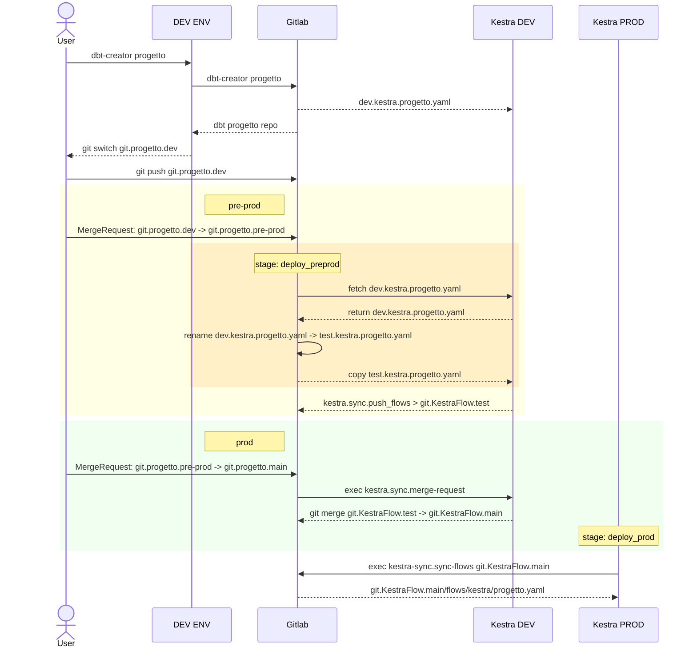

**Regole e flusso per promozione dei progetti dbt e delle pipeline di orchestrazione tra i vari ambienti**

# DIAGRAMMA SEQUENCE

![[04_09_56.jpg]]

## AMBIENTI

Kubernetes: due ambienti separati mediante namespace 
- DEV
- PROD

Nell'ambiente DEV abbiamo i seguenti ambienti per dati e pipeline:
- dev (ambiente di sviluppo)
- test (ambiente di test)

Nell'ambiente PROD abbiamo i seguenti ambienti per dati e pipeline:
- stage (ambiente di pre-produzione)
- prod (ambiente di produzione)

## ATTORI

- Utente Sviluppatore
- GitLab
- Kestra DEV 
- Kestra PROD 

### Utente Sviluppatore

Utente sviluppatore dei progetti dbt

Ruolo:
- Responsabile dello sviluppo e test dei processi dbt
	- sviluppo in ambiente dev
- Effettua le Merge Request per la promozione dei processi
	- da ambiente dev ad ambiente test 
	- da ambiente test ad ambiente stage (con cambio di ambiente Kubernetes)
	- da ambiente stage ad ambiente prod

### GitLab

Repository del codice sorgente.

Le repository contenute su GitLab sono:
1. Repository del template cookie-cutter del progetto dbt (in ==/dbt/models/cookiecutter-dbt-template-kestra==) a partire dal quale vengono create le repository dei singoli progetti dbt
2. Repository dei progetti dbt (in ==/data-platform/dbt/==) creati a partire dal template. Ogni repository contiene:
		1. il progetto con il codice e la configurazione di dbt
		2. una directory /flows/ che contiene il flow base Kestra definito in un file \<progetto\>.yaml. Durante l'inizializzazione del progetto questo file viene inviato a Kestra per essere in grado di poter orchestrare la pipeline.
		3. un file .gitlab-ci.yml che contiene la definizione della procedura ci/cd per le pipeline Kestra 
			1. stage deploy_TEST: copia pipeline kestra da dev a test 
			2. stage deploy_STAGE: copia pipeline kestra da test a stage 
			3. stage deploy_PROD: copia pipeline kestra da stage a prod 

		4. uno script python per la gestione del processo dbt (esecuzione, documentazione e versioning su git)
	  I vari ambienti sono gestiti tramite appositi branch
3. Repository che contiene tutti flow Kestra per tutti i progetti dbt (in ==/data-platform/kestra/kestraflow==): utilizzato per copiare i flow Kestra da ambiente Kestra DEV ad ambiente Kestra PROD 

I ruoli svolti da GitLab sono:
- Gestione del versioning e del branching delle repository descritte
- Gestione della procedura di ci/cd per la promozione dei seguenti artefatti nei vari ambienti effettuata attraverso un meccanismo di Merge Request:
	- Progetto dbt (viene effettuata commit su relativo branch target)
	- Pipeline Kestra (invio della definizione della pipeline nel relativo namespace Kestra e gestione dei branch della repo kestra_flows)

### Kestra

Orchestratore delle pipeline dbt e ausilio nella procedure ci/cd. 

Esistono due istanze Kestra separate:
- Kestra DEV (sviluppo/test)
- Kestra PROD (staging/produzione)

Entrambi contengono:
- Pipeline di esecuzione dei progetti dbt separate mediante namespace all'interno di kestra
	- dev.progettodbt (DEV)
	- test.progettodbt (PROD)
	- stage.progettodbt (STAGE)
	- prod.progettodbt (PROD)
- Pipeline di sincronizzazione degli ambienti kestra DEV e PROD
	- la sincronizzazione avviene utilizzando una repo git come serbatoio di interscambio ==/data-platform/kestra/kestra_flows==
	- una pipeline si occupa di scrivere i vari flow dall'ambiente Kestra DEV su git
	- un'altra pipeline copia i flow da git all'ambiente Kestra DEV

Responsabilità:
- Esecuzione delle pipeline dei progetti dbt 
- Esecuzione delle pipeline di sincronizzazione delle due istanze Kestra 

## FASI

### FASE 0 - SVILUPPO

**Utente esegue Script dbt-creator** che crea 
- **Il progetto dbt** configurato con il profilo "dev" e con il brach git "dev" 
- **Configurazione pipeline kestra** (nella dir "flows/" del progetto) che contiene il file yaml kestra: serve per inizializzare il flow su kestra (su namespace dev.progettodbt). NOTA: non viene poi più utilizzata
- **Creazione pipeline ci/cd gitlab** (in file .gitlab-ci.yaml) contenente le azioni da effettuare nei vari stage per promuovere le pipeline Kestra nei vari ambienti (gli ambienti sono segregati mediante namespace)
	1. dev -> test.progettodbt
	2. test -> stage.progettodbt
	3. stage -> prod.progettodbt

**ATTENZIONE**: se si deve modificare flow kestra bisogna farlo su Kestra e non sul file yaml della repo del progetto (che serve solo per l'inizializzazione del floe)

### FASE 1 - DEV -> TEST 

**Passaggio da dev a test/pre-prod**
1. Utente effettua una **Merge Request**
2. L'approvazione della Merge Request determina 
	1. la merge del codice dbt sul branch test con profilo dbt test
	2. l'esecuzione della pipeline ci/cd (.gitlab-ci.yaml) nello stage deploy_test che effettua copia del flow Kestra dal namespace dev.progettodbt al namespace test.progettodbt. Le operazioni effettuate sono dallo stage deploy_test sono:
			1. curl (GET) della pipeline da Kestra DEV
			2. cambio namespace (dev -> test)
			3. curl (POST) della pipeline su Kestra DEV
3. A questo punto la pipeline Kestra è disponibile sull'ambiente test per l'esecuzione

### FASE 2 - DA TEST A STAGE

Questa fase è più complessa perché per poter effettuare la promozione nell'ambiente prod è necessario sincronizzare le pipeline Kestra tra due diverse istanze di Kestra (DEV e PROD). 

La sincronizzazione avviene mediante due pipeline Kestra (pushFlows e syncFlows) che utilizzano una repo GitLab come serbatoio di interscambio ==/data-platform/kestra/kestra_flows==:
- pushFlows: scrive le pipeline presenti sull'ambiente Kestra DEV nel namespace test.progettodbt (pipeline che hanno passato la fase 1) nella repo GitLab ==/data-platform/kestra/kestra_flows==
- syncFlow: legge le pipeline dalla repo GitLab ==/data-platform/kestra/kestra_flows== e le scrive sul Kestra PROD nel namespace prod.progettodbt

La pipeline pushFlows è schedulata e asincrona rispetto alla procedura ci/cd che avviene a seguito della approvazione della Merge Request. 
Anche la pipeline syncFlows è schedulata e asincrona rispetto alla procedura ci/cd. La pipeline Kestra sarà disponibile sull'istanza PROD solo dopo che viene eseguita syncFlows, 

**Passaggio da test a stage**
1. Utente effettua una **Merge Request**
2. L'approvazione della Merge Request determina 
	1. la merge del codice dbt sul branch stage con profilo dbt stage
	2. l'esecuzione della pipeline ci/cd (.gitlab-ci.yaml) nello stage deploy_STAGE che lancia la pipeline Kestra **mergeTestOnStage** (mediante curl POST) 
	3. la pipeline mergeTestOnStage effettua una merge git sul branch stage della pipeline Kestra 

**ATTENZIONE**
- La Merge Request deve avvenire DOPO che è stata effettuata la pushFlow delle pipeline Kestra, altrimenti la pipeline non è presente sul branch test della repo git ==/data-platform/kestra/kestra_flows==
- La pipeline Kestra sarà disponibile sull'ambiente prod per l'esecuzione solo dopo che è stata eseguita la pipeline asincrona syncFlows

### FASE 3 - DA STAGE A PROD

**Passaggio da stage a prod**
1. Utente effettua una **Merge Request**
2. L'approvazione della Merge Request determina 
	1. la merge del codice dbt sul branch prod con profilo dbt prod
	2. l'esecuzione della pipeline ci/cd (.gitlab-ci.yaml) nello stage deploy_prod che effettua copia del flow Kestra dal namespace stage.progettodbt al namespace prod.progettodbt - Le operazioni effettuate sono dallo stage deploy_test sono:
			1. curl (GET) della pipeline da Kestra PROD
			2. cambio namespace (stage -> prod) 
			3. curl (POST) della pipeline su Kestra PROD
3. A questo punto la pipeline Kestra è disponibile sull'ambiente prod per l'esecuzione

## NOMENCLATURA

### BRANCH GIT

- dev 
- test
- stage
- prod

### STAGE CI/CD

- deploy_TEST
- deploy_STAGE
- deploy_PROD

