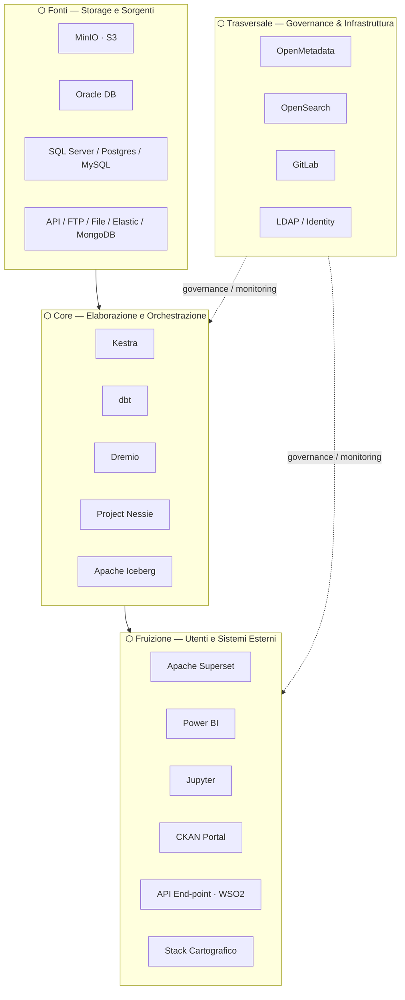
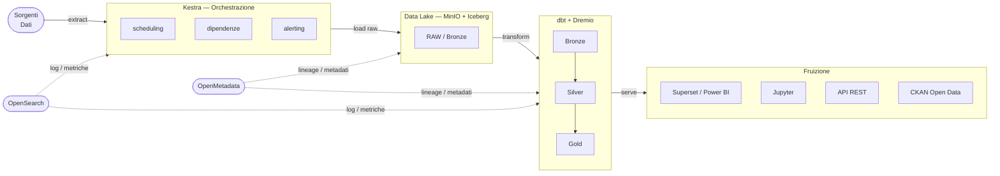

VERSIONE HTML
![[architettura_data_platform.html]]

# Data Platform Regionale — Architettura

> Documento di riferimento: LD23GPS-PA7665-002 v1 · Liguria Digitale / Regione Liguria
> Schema sintetico con componenti adottati (include variazioni rispetto al documento originale)

---

## 01 — Schema per livelli logici

---

## 02 — Pipeline ELT: ciclo di vita del dato

> **Pattern ELT**: il dato viene estratto grezzo, caricato nel Data Lake, poi trasformato in livelli progressivi (Bronze → Silver → Gold). Tutto il codice è ospitato e versionato in **GitLab**, che gestisce deployment via CI/CD su tutti gli ambienti (dev / test / prod).

---

## 03 — Dremio come hub centrale di accesso al dato

```mermaid
flowchart LR
    subgraph SRC["Sorgenti"]
        M[MinIO / Iceberg]
        N[Nessie Catalog]
        O[Oracle / SQL Server]
        F[Altri DB / File]
    end

    subgraph DRE["Dremio\nQuery Engine · Data Virtualization"]
        direction TB
        D1[VDS / PDS]
        D2[Reflections cache]
        D3[Semantic Layer]
        D4[Row/Col Security]
    end

    subgraph CON["Consumer"]
        C1[dbt — trasformazioni]
        C2[Apache Superset]
        C3[Power BI]
        C4[Jupyter]
        C5[API REST end-point]
    end

    SRC -->|SQL · ODBC · JDBC\nArrow Flight · REST| DRE --> CON
```

---

## 04 — Componenti

### MinIO
`#storage` `#object-storage` `#data-lake`

Object storage S3-compatible. Cuore fisico del Data Lake. Cluster da 4 nodi (16 CPU · 32 GB RAM · 4×1 TB flash per nodo) con erasure coding per ridondanza. ~32 TB utilizzabili.

**Funzionalità:** S3 API · Erasure Set · Bucket Notifications · Versioning · Data Tiering · LDAP/OpenID

---

### Apache Iceberg
`#table-format` `#storage` `#data-lake`

Table format open source per il Data Lake. Abilita transazioni ACID su object storage, schema evolution e time travel su file Parquet/ORC.

**Funzionalità:** ACID · Schema Evolution · Time Travel · Version Rollback · Hidden Partitioning

---

### Project Nessie
`#table-catalog` `#versioning` `#data-lake`

Catalogo transazionale con versionamento git-like del Data Lake. Gestisce branch e merge su insiemi di tabelle Iceberg. Deploy: 1 nodo · 2 CPU · 8 GB RAM · 50 GB storage.

**Funzionalità:** Git-like branching · Multi-table versioning · Metadata catalog · S3/MinIO backend

---

### Dremio
`#query-engine` `#data-virtualization` `#semantic-layer`

Data virtualization layer e hub centrale di accesso al dato. Espone interfaccia SQL unificata su fonti eterogenee. Cache in-memory via Reflections. Cluster: 1 coordinator (16 CPU · 32 GB) + 3 executor (16 CPU · 128 GB ciascuno).

**Funzionalità:** ANSI SQL · Arrow Flight · ODBC/JDBC · VDS/PDS · Row/Column Security · Semantic Layer · Data Lineage

---

### dbt
`#transformation` `#sql` `#data-modeling`

Repository centralizzato di tutte le trasformazioni SQL/Python della piattaforma. Integrazione nativa con Dremio (query engine) e Project Nessie (branching dev/prod).

**Funzionalità:** SQL + Python · Macros · Data Tests · Auto-documentazione · Nessie branching

---

### Kestra
`#orchestration` `#scheduling` `#pipeline`

Piattaforma di orchestrazione scelta per il progetto *(non nel documento originale)*. Gestisce scheduling, dipendenze, monitoring e alerting di tutte le pipeline ELT. Paradigma dichiarativo YAML.

**Funzionalità:** DAG/Flow · Scheduling · Event triggers · RBAC · Alerting · Web UI

---

### OpenMetadata
`#data-catalog` `#data-governance` `#data-quality` `#lineage`

Catalogo dati unico per tutto il patrimonio informativo regionale. Fonte di verità per metadati, lineage, qualità del dato e governance. Scelta adottata in sostituzione di DataHub.

**Funzionalità:** Data Discovery · Data Lineage · Data Quality · Ownership/RBAC · Webhook · dbt integration · LDAP/SSO/SAML · DCAT-AP/AGID

---

### Apache Superset
`#bi` `#visualization` `#dashboard`

Piattaforma BI open source. Affianca Power BI per la visualizzazione interattiva. Connessione a Dremio via `sqlalchemy_dremio` (ODBC porta 31010 / Arrow Flight porta 32010). Supporta embedding dashboard in applicazioni React.

**Funzionalità:** Dashboard · Chart Builder · Row-level security · Embedding React · LDAP/OAuth

---

### Jupyter
`#exploration` `#notebook` `#python`

Ambiente notebook per data exploration, analisi interattiva e prototipazione. Accesso a Dremio via SQL/Arrow Flight. Scelta adottata in sostituzione di Zeppelin.

**Stack Python:** Pandas · NumPy · GeoPandas · Leafmap · Seaborn · PySpark

---

### OpenSearch
`#monitoring` `#logging` `#observability`

Log aggregator centralizzato per tutti i nodi e componenti della piattaforma. Raccoglie metriche via agenti **Metricbeat** (push). Fork open source di Elasticsearch v7, tutte le funzionalità gratuite on-prem.

**Funzionalità:** Full-text search · Metricbeat agents · Alerting · ML anomaly detection · Dashboard

---

### Stack Cartografico
`#geo` `#spatial` `#gis`

Insieme di librerie e componenti per l'analisi e la visualizzazione geospaziale, integrate nella piattaforma e nel Data Lake.

| Componente | Ruolo |
|---|---|
| GDAL | Conversione formati raster/vettoriali (COG, GeoParquet) |
| DuckDB Spatial | Query analitiche geospaziali in-process (funzioni PostGIS-like) |
| GeoPandas | Analisi spaziale Python (buffer, intersezione, unione) |
| Leafmap | Visualizzazione cartografica interattiva in Jupyter |
| deck.gl | Rendering WebGL2 di grandi dataset geografici |
| PBI-Carto | Componente custom per mappe tematiche in Power BI + WMS |

---

### Distribuzione Open Data
`#open-data` `#distribution` `#api`

Insieme di componenti per la pubblicazione e distribuzione dei dati aperti a cittadini e sistemi nazionali (PDND).

| Componente | Ruolo |
|---|---|
| CKAN Portal | Front-office per consultazione pubblica del catalogo |
| OpenData Downloader | Download dataset dal Data Lake (da sviluppare) |
| API REST · WSO2 | Interoperabilità con sistemi esterni e PDND |

**Conformità:** DCAT-AP · AGID · PDND

---

### GitLab
`#source-control` `#ci-cd` `#infrastructure` `#container-registry`

Sistema centrale di source control, CI/CD e Docker Registry. **Istanza unica** che governa tutti gli ambienti della data platform (dev / test / prod). Ospita sia il codice infrastrutturale (Helm charts dei componenti) che applicativo (progetti dbt, script di pipeline).

**Funzionalità:** Git repository hosting · Branching & versioning · CI/CD pipelines · Docker Registry · Helm charts · Multi-environment (dev/test/prod)

---

## 05 — Scelte adottate rispetto al documento originale

| Ambito | Documento originale | Scelta adottata | Note |
|---|---|---|---|
| Data Catalog | DataHub (valutato) | **OpenMetadata** | Architettura più semplice, pull-based ingestion, integrazione nativa dbt, SSO/SAML |
| Orchestrazione | Airflow · Mage · NiFi (valutati) | **Kestra** | Non nel documento; UI moderna, paradigma YAML dichiarativo, ELT-native |
| Source Control / CI-CD | _(non trattato)_ | **GitLab** | Istanza unica cross-ambiente; gestisce infrastruttura, codice e immagini Docker |
| Notebook | Zeppelin (valutato) | **Jupyter** | JupyterHub/Lab; stack Python completo con supporto geo |
| Message broker | Kafka (previsto) | ❌ Non implementato | Ingestion diretta via Kestra |
| Processing engine | Spark (previsto) | ❌ Non implementato | Processing delegato a Dremio (Reflections) e dbt |
